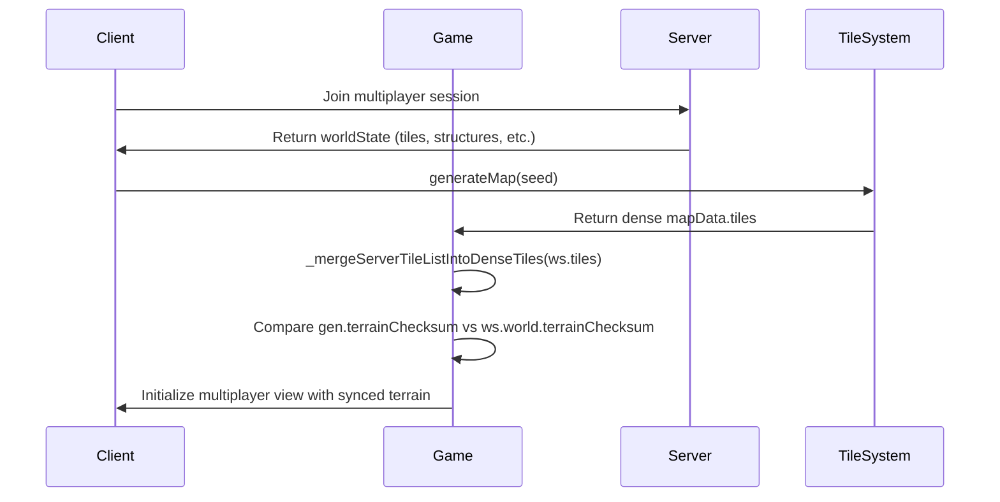
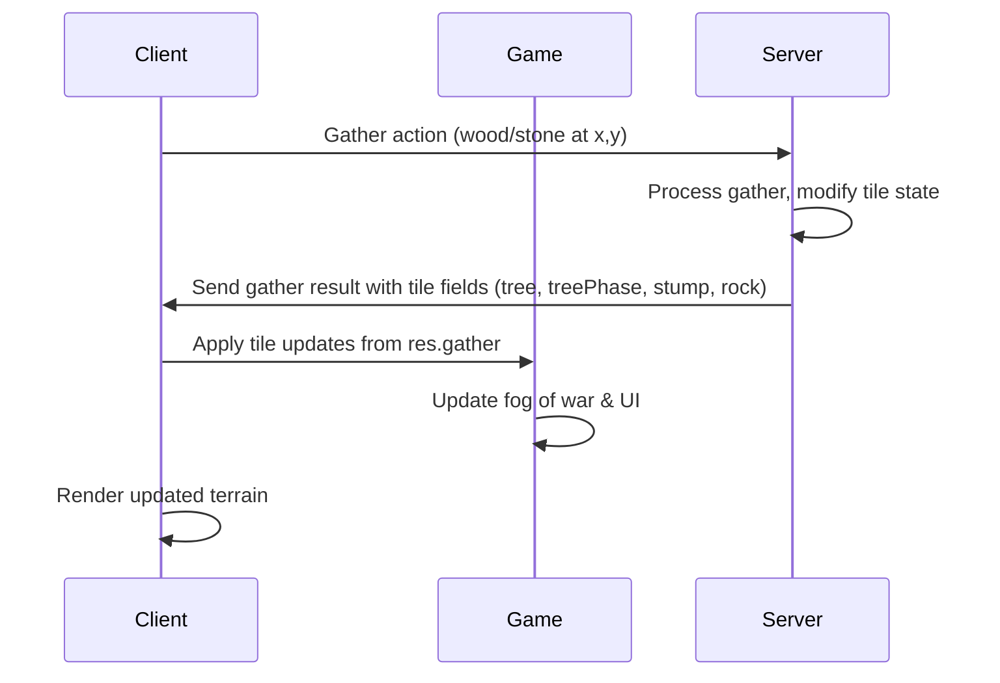
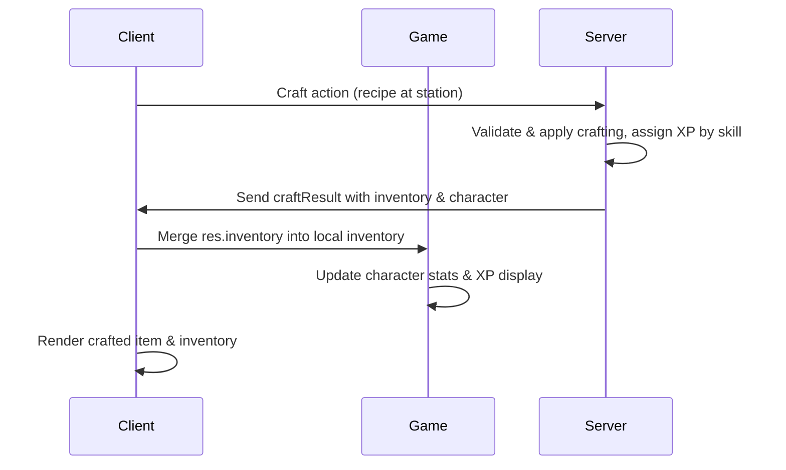

# feat(mp): dense tiles, authoritative gather tiles, craft inventory sync

- Build mapData.tiles from generateMap(seed) and merge server tile patches on join, worldState, and applyMultiplayerWorldState; fix terrain checksum compare to local gen.
- actionResult.gather includes tree/treePhase/stump/rock; client applies server fields.
- craftResult passes inventory and character to pending handler; server craft XP by station.
- worldState applies server player inventory each tick.
- Docs: CURRENT_STATE, SCOPE, GDD_AUDIT, NEXT_VALUE_INCREMENT.

<!-- This is an auto-generated comment: release notes by coderabbit.ai -->

## Summary by CodeRabbit

## Release Notes

* **New Features**
  * Enhanced multiplayer terrain synchronization for consistent world state across all players
  * Crafting now awards skill-specific experience points based on station type

* **Improvements**
  * Environment effects (day/night, weather) now synchronized on the server in multiplayer sessions
  * Gathering actions properly sync resource and terrain changes across the game world
  * Terrain generation improved for better parity in multiplayer environments

* **Documentation**
  * Clarified product naming conventions and design documentation structure

<!-- end of auto-generated comment: release notes by coderabbit.ai -->

## Conversation

### 2026-04-13T03:09:27Z · coderabbitai[bot] (bot)

<!-- This is an auto-generated comment: summarize by coderabbit.ai -->
<!-- This is an auto-generated comment: failure by coderabbit.ai -->

> [!CAUTION]
> ## Review failed
> 
> The pull request is closed.

<!-- end of auto-generated comment: failure by coderabbit.ai -->

ℹ️ Recent review info

⚙️ Run configuration

**Configuration used**: defaults

**Review profile**: CHILL

**Plan**: Pro

**Run ID**: `59cada25-b354-4e9e-b0a1-c17085102630`

📥 Commits

Reviewing files that changed from the base of the PR and between aa01f781bed408796bbea531b405dca45628b088 and 833fa0fe055b98da9919691437a1ad86a4bede3a.

⛔ Files ignored due to path filters (2)

* `dist/assets/index-BMw_GueV.js` is excluded by `!**/dist/**`
* `dist/index.html` is excluded by `!**/dist/**`

📒 Files selected for processing (6)

* `CURRENT_STATE.md`
* `GDD_AUDIT.md`
* `NEXT_VALUE_INCREMENT.md`
* `SCOPE.md`
* `server/index.js`
* `src/game/game.js`

---

<!-- walkthrough_start -->

📝 Walkthrough

## Walkthrough

Multiplayer terrain indexing now uses dense tile maps generated via `generateMap()` with server patches merged through a new `_mergeServerTileListIntoDenseTiles` method. Server gather payload extended to include tile state fields, and craft XP assignment made dynamic based on recipe station. Documentation updated to reflect dense tile implementation, server authority expansion, and scope clarification for multiplayer environment synchronization.

## Changes

| Cohort / File(s) | Summary |
|---|---|
| **Documentation**   `CURRENT_STATE.md`, `GDD_AUDIT.md`, `NEXT_VALUE_INCREMENT.md`, `SCOPE.md` | Updated design docs to describe dense multiplayer tile indexing via `generateMap()` plus server patches, clarified GDD title vs repo name, marked implementation items as complete, and revised MP v0.1 scope to state day/night/weather are server-synchronized (not client-local). |
| **Server Gather & Craft Logic**   `server/index.js` | Extended gather action payload to include tile state fields (`tree`, `treePhase`, `stump`, `rock`); replaced fixed crafting XP with dynamic skill selection based on `recipe.station` mapping (FORGE→SMITHING, LOOM→WEAVING, KITCHEN→COOKING, otherwise CARPENTRY) awarding 15 XP. |
| **Multiplayer Join & Tile Merging**   `src/game/game.js` | Added `_mergeServerTileListIntoDenseTiles()` method to apply server tile fields onto dense row-major grid; refactored join to generate dense map first via `generateMap()`, then merge server tiles; updated world state application to merge tiles and inventory; changed gather result handling to apply tile fields from payload directly without client-side progression logic. |

## Sequence Diagrams

## Estimated code review effort

🎯 4 (Complex) | ⏱️ ~50 minutes

## Poem

> 🐰 *A denser map now blooms and grows,*  
> *Dense grids where server wisdom flows,*  
> *Tiles merge when players join the fray,*  
> *Gather brings XP in new ways,*  
> *Hearth-bound realms in sync today!* 🌲✨

<!-- walkthrough_end -->

<!-- finishing_touch_checkbox_start -->

✨ Finishing Touches

📝 Generate docstrings

- [ ] <!-- {"checkboxId": "7962f53c-55bc-4827-bfbf-6a18da830691"} --> Create stacked PR
- [ ] <!-- {"checkboxId": "3e1879ae-f29b-4d0d-8e06-d12b7ba33d98"} --> Commit on current branch

🧪 Generate unit tests (beta)

- [ ] <!-- {"checkboxId": "f47ac10b-58cc-4372-a567-0e02b2c3d479", "radioGroupId": "utg-output-choice-group-unknown_comment_id"} -->   Create PR with unit tests
- [ ] <!-- {"checkboxId": "6ba7b810-9dad-11d1-80b4-00c04fd430c8", "radioGroupId": "utg-output-choice-group-unknown_comment_id"} -->   Commit unit tests in branch `test`

<!-- finishing_touch_checkbox_end -->

<!-- tips_start -->

---

Thanks for using [CodeRabbit](https://coderabbit.ai?utm_source=oss&utm_medium=github&utm_campaign=TomMkV/stillwood&utm_content=1)! It's free for OSS, and your support helps us grow. If you like it, consider giving us a shout-out.

❤️ Share

- [X](https://twitter.com/intent/tweet?text=I%20just%20used%20%40coderabbitai%20for%20my%20code%20review%2C%20and%20it%27s%20fantastic%21%20It%27s%20free%20for%20OSS%20and%20offers%20a%20free%20trial%20for%20the%20proprietary%20code.%20Check%20it%20out%3A&url=https%3A//coderabbit.ai)
- [Mastodon](https://mastodon.social/share?text=I%20just%20used%20%40coderabbitai%20for%20my%20code%20review%2C%20and%20it%27s%20fantastic%21%20It%27s%20free%20for%20OSS%20and%20offers%20a%20free%20trial%20for%20the%20proprietary%20code.%20Check%20it%20out%3A%20https%3A%2F%2Fcoderabbit.ai)
- [Reddit](https://www.reddit.com/submit?title=Great%20tool%20for%20code%20review%20-%20CodeRabbit&text=I%20just%20used%20CodeRabbit%20for%20my%20code%20review%2C%20and%20it%27s%20fantastic%21%20It%27s%20free%20for%20OSS%20and%20offers%20a%20free%20trial%20for%20proprietary%20code.%20Check%20it%20out%3A%20https%3A//coderabbit.ai)
- [LinkedIn](https://www.linkedin.com/sharing/share-offsite/?url=https%3A%2F%2Fcoderabbit.ai&mini=true&title=Great%20tool%20for%20code%20review%20-%20CodeRabbit&summary=I%20just%20used%20CodeRabbit%20for%20my%20code%20review%2C%20and%20it%27s%20fantastic%21%20It%27s%20free%20for%20OSS%20and%20offers%20a%20free%20trial%20for%20proprietary%20code)

Comment `@coderabbitai help` to get the list of available commands and usage tips.

<!-- tips_end -->

<!-- internal state start -->

<!-- DwQgtGAEAqAWCWBnSTIEMB26CuAXA9mAOYCmGJATmriQCaQDG+Ats2bgFyQAOFk+AIwBWJBrngA3EsgEBPRvlqU0AgfFwA6NPEgQAfACgjoCEYDEZyAAUASpETZWaCrKO3IZgIyRAKASQAZiTUABTM3ACUXEoYiCSQ4gA20gA0OLiw+BTq1JJxRNSwlPHwSYipDFT+uCgYUhgELvayGAwGUACqNgAyXLC4uNyIHAD0w0TqsNgCGkzMw9AsALIA1gBqw4iJCQDu+IrD3NgJCcOebZDtsRRcC8wrq+cAyvjYFAxxAlQtsFw0m5CAJMIYM5SNVPpgGD9IMxtBgnrhqNghvxuGRzgBhChBGj0ahcABMAAZ8QA2MCEgAsYE8AGZoISaRxCQBOJkkgBaRgAItIKvBuOJ8Fhgv40GJkP4KCxrDZIucYdwudQ0BpEtJ0FjIBh8NtIAJsCVqpLpaRyFQaIs0NxgrE6OF0Bh6FcpHw1TxqJD1c44mwKKR6ELIEJ8PAMKldhQErRHgiaKlMLjuNwErJFkdxMm0LJKAB1TJRmPUEgaGCUKihxiFBjLBzMBRhZxIQMESAJfAMNAJSCm5SCrDbNAS+AADzoGnOYr7Nmk6Y0+XSRW1utDDAS2CUyFwWJIqS3JBIVlgg539lwjm48cdkCl1YC8BIUcQAG54oVGAl7/V0EmP+r0vhYnsSgXTAXh8AkeAlHofx70fccoAqNAqmnBwEmqJd3UQWJkFDOoGnkBNK2cScihbBceDIWhQyISAj0dJIKBfZ0ijQAcKFoZBEKqSAAA0rD1eRNhyIV4MgCMC1jOIrWTe9NzfZi+EzbM+Fw9hMnkIJIWKatRK5dtHHYYSsGwbhaCLZF0U6GwAFEADloAAfUeaAAEFoGs1JHnRAB5KwPMgABxLkuQclz2i5ABJaBUls6yeMc1YXK6dprIciLbPRGzFjs6BxwMYJbPwewphEMRchqGgKF4EhY3gQMVzXKCNHCIx9GMcAoEo/h/DSQge3NOh6zYeouF4fhhFEcQpBkeQmCUKhVHULQdDakwoDgVBUEwXriDIXtBtmYbOGvVjiqcRo5AUeaVDUTRtF0MBDHa0wDEsmwbPspzXPcjRmFoDgDAAImBgwLEgFyIt2s0iydRwYUafAeshTBSEQIx2lMmHIAAAzej7HOctzrN+2hsfiIqsX8JIxEgaIrmhdN+QSLNSLLWEaiUYdqN+N9V0/dCdT1PZcGQbYJnQWmyEAt0FQCKU62x/qi0ta1bVocIycI6Tf2QBTiiSd1cE9ZAILQHGHN9UhHmAyhoBKEguiQXAIvqfAeRiEg7dKbHUmWfduGo/W4neY5kE7eAiHIeh0ilbAiFgHG1QxsycU1q9sfE6NJLJkhh2TTI6DAMXHUF7X4A7PsS3RTIsUQbghSojAaNz0Q8FyMBa3hgir0AHAIgq5HgSmZigTZwsIkiOozAFwCa8dWQDCNz5AQ4mDUMwHENh4jZitPWrMPkEVvaBpVsm2w7LsJF1m2+DVy96FREenbId50BwlpGsDjI2E2IJ77XZBmCKHgDBQaapkDBG2IULA2MuRuRcgAIRco8VKnQuhk1QLEXA4QSwuQSIgCmJAIKxGjvJSS9BFj8QkISDQ3hEBMFRK2UMcQKzMEZsmOImZ3ibiKogLMDM0JMxZjfZoDAr4UBdJAHuZAIJSgwEdGeEDsSFAoMMDeJAwCIzAGZWQ9oXQOE4r+eoGiMApkkbEQcQoygz0IliQBUgSFxHwFGRc+AaDvm0MwQO5E6H4AYR+cgp4h6SzoVkZe9BtHDAwBHPowxthKJYgY/mYAiHYE7Dg2gUEHSQFzjJBg6gcYKiVAiVU9tEBkylNsMAMJgwqUdLnQOi8sgCjqlgXAshA4CGPP4vIR8jKpD1pbE8hEhREBDE3RO9tk4w01h+SOR08rmEsLgyqRluGvjiEoVcxE+zIERtkvOmQcT8EUlMD8DBsn1HULJIwhUAnBFoPpSefZjGmORk3dUFZcZWRyl9ImJNsbYMWZAS0UTAj/AAGL23BhgTssgABelAjCO3IJxOi/ouAAGoSTDDAAAViMNZTY8AYRHLmnELEEESC6hIP4fwhyuCLDoPARwQMQZtBev3UK4UookwBsDQGoMlmQyVkczuzh5B7LeajVq4MMmDTNlsrIMEK4tMYQEis5E0DrnyYUNA80NRBFPDkcZ5EABUpr+5iUyMsLx6gkjmpQMgHuAAJIIFB0gCBeI6ZIM9IFQrNaarE9cDhSloNgGmMK2AOtQD3GMQ9diKB9WJcWLq3Ueq9bQGeLZl7xCxFjQc6zabtmKLgA2QoUwlkgOcKZRyADl3hgg91WEgVVAAyQexxnCICnvaWIZVmy5zBPIUMW5FDhsDmbTx2o+B0ooCS8Q4ypVxDIm+XVjcaLdMgMEQdVBc3aH8TRP1fxuBihIPaMW/48DoDQpQQOTB6jsGhEEKJTdK3nBdpAWt+It09zzJGcJ0gI4YB7akINzN3i4iwIObCiAjqvmoJAc1e4SDDBvMsHg4GSBwaROqbUGAtE1UoFOp25ccaWnSBoL4DzmDYwdRehO21oPSFg4+9ICGkPblQ+2ZYGwtzhrPLXLUgscM4zVnQGwCYWDgsyNXTIpMHWzslpVYjRLzmcKw+wO+14aVUDYA47TMJQyBxPVkNp14kDoYLeavmj7V5YBPbINser7BHlRA6qitLKDP3VPcqWeQsj0EvhM0oLtm1UoBSdBcro6KQBsLZAKb6oAfvrd+xt0BRCwCiefDUkJ1CTVeCQED+yT11P03rLV/5TMESwsxo6XB5zKKE7qc1rDJJiIkWAh1hEsPqGQOa7GSdMap3Nf06+wL+IYRw3101dM4iH2hhaK0ZNkxIiAuI0iUKT1G0KIgEbDp6BcngRRR+P8WjMOQI0+AYTX6IdNb4vsnYAiZGhEAkB0dSnmpfEkbiqlXYuGGFxXAAOWCdIFkcgtRLji3e1LgBTRxTEVYyKZnIUhEuQA/eRau78kQtNA4QpAoC3w93DnM9gM9d7LA/JsLgtjwKDSw9wI8iBUCBh7szpuBt8GvBfnsvj6RrFXlDD/ZzQk/i3bE3/U9R0utXnNXrBrRQMWQEO0HSWaFBxdc1KGcM4tyDDmqD/QYLngFHJbOa2ba2OtQsQCI/gWA7My/oHL6+YBEeZGyFNZhtQ1KNCV4Dmo42HXL1nXEZ363XTl3Qy8I2LB1RK+DK8GFXZjR1kIewXbpq8qQCrYK8GN7zQtLWeRTZw9VndWK4cwaz3DgCDORc8Q4hpAytst5WKSKmGopRnQTF2KwAUgJUSklB1FDkvx1S7JtL6WQC6DqVlAr2VgBuXFBKSUUppQyllHKvK5+54hlDfasNzoSqRmipvBhpzqbkhwrIz2e42a/FNy3G2DYpzQDPS7zTAwQIQFpLZxLCfByGLVBGbiCdimJYi/gBjQKZyFg0AlLew3bbRryUq6jFwPK6iEQIDxyzJ9Dyo8AATM614bJ+bEABYcz1LjKeKwYeiwDnrixIHjwab1BGTBJ8if79jKI+hsLMzKQKAxB8bigSwW7YyFLKjwHSBkxEBkGmw4wiokAqzBAaz7brJYB06RhZhhx4BI4e7lRuggKPhyzSgZz5hZxFjiFlKQA47jLYwWyUBWzXxewOxOwuwEDuyxCOFlKpAra7JNxjI0RbZaRlwqqBgyEDaTJDZ0Bpz3y3pALnLGH/qwEkDYwlg1p/hviVTlj2aNhmZ9p9iGF1hmxs5bD1gmaDSKYmbqDyBsQvpEDdpWrsQTpXi07TSFpKAIj2z0A9wW5Yh1JZBNwA5oBSAIZK6TiF7gzDDwIzxEAGhmRnZ46cKBz5L0ZCHwBYg0yi5MHVBsbVB2YlHejIBnyPbzaqjbwYDohVg1iOCaz5BC7VAZyIAaCZwnEUCZHnGiCXE0YlgY5E62SDo1AVCbEzw+KoipDww1iFrgjfAoA0DMD7xFp3IW4UJBxlDdgFDP4kAYq/b4R3gPgcTKHajvhJLM5KA8BM5xDM6sLMx9jlCVDVDnwJCdK3gYRrEkCSCBzYxYnqRRE4zIxUBiCUA+zKHxESRFiaw/jtLWHbAPFKSUAaCckuARaEQmQpzqixrFG+JkBZpFQ5JnJ2ryBU50mTAYDoabB5pTpEDxgMBMDYD1AomET+Dw5BgvAUBJ72DEpbrLHbT3YtKPbtA8TvjPomRPYzr7qDQK4jzYKQCQpJ6mJUz8i6zhpcKIBgB8iVTwAKoXGeqjgSjyyWHfDvGgJFQU7ypXjKnmSFqA5jBol8CzDsJ5ERjrrkzQg0GFrkC6hUw6gLK7755l4rrEGKpl57I5KV4BgnK16kbsBXJn5QC3JxD3KPKGTPLlqzSn4B7YyxTxQOSJTJSpTpSZTWTZT2T/KAoGDIrqhLr/SQAYqeAUg4r4gADsA+G8WMZK2mKBE+s6x0jKVELK/KrUL0XkvkxMf0fKIMYMe+chh+Xc5eS6aMBgqRZWZC/CGYPBRQVCNC9g9CJANOJA6m+m1UEELwyA0xxED6y6R41Q5uWYkS0S1QhEcS1ZmugBSSKSj2NpiQbpBRWh7uZmOSCYos9BWo4+f+dY2xt2ESUS8cdFV4DFUWTF4uLuNu3wsi8ACKtA0aWAlJKFQi4YCABszuFiMQDqti7M1mQBYAhxCQ5qJYcAo+/wvOb4Qo6im6wJc5965AZUEEbSo2rJ4ymkCcrijWdiJ4CkYAjJfs0c24qJUW1EqQAAfjSISFUqGHgKPu5ZNMmpetUG2OzjRLySRDfJJPaKgDaReW+kYN2Ssjsk2cXqIKXtVUOQcu6lXmOXXpOY3nBTOU5Vug8gwAZMwUuSYiuV3muYBX5MeXlGDCCsAtINUJCgbC5EnvCoiqeR3kRO8pedeTimcAYISs+aSiPm+feNSpPu6lwDPtsDvgvkYApMMKGJzBoEIEMDvuBcKr0qKnDOKjBafmjB0BEfporNWctlmE5vQD1v0INBqm+NjKMUKGTHRLQAxMGULOkDjAmqTEKZsE5WTC2A1OuFJBklckKI9m6BsTiY+FwANtuIKVTfuIeMeGTL5qKIzCakVNjISACqkNjJsOeIzUoMzQIqzTjBgPDpzUKWhoKZ2CMsSeRXEPUkStYcODTbIDTbXM6e8JLenGgIAuxckdnhiKfvQIDoHHxK/MzqTiNNpnhRLDBKOPQNjDKRQDMEeHyZVFoBkjxNaAAOSZQuTgrQDpQBRe2pC4pKHLG0DNDa2kam2IA2pQ6xDUx5GdLEJ244xrH8jFii4tKCkKgBzWHgreQ2ABTWQAiPCLBRTOqB001dDeTeSLAAg5jWQuSrBV1c0ADSUU6IzqdkAIPk3kHd8WgpgVlAYsgEuMLkNgfk9kNgAAmprbiGxI2djJ4LimTKbYpt4g+JNINLHUPF2eBT2dVX2ZLAOQ1T1MOc1aOTwKchOZch1ecLOXlGeZ3htZiviMyDijSE+cSi+YdRSsdR+VPs6tEldRAIvgYIgG8FWWwNA8WE9aBQKq9fvgNFBV9ZKj9TKmmAIo7U6aGMMLLCAemR+HCiwQvLei0UgVEqAV2BbrLCnrIe9fIVaIoYzccWAjTaaI8ZBOkMMIULRRw2QM8a8RcbWBFrcb/DBZYgIQujRORA6VDm6M4FQPIFRGsaWvIPQ/ceYWTFYTRGbJZTjGoLHgsI4WTLndRKJC5HKvbbYX6CQNbOHo4Y7JsC4W7H5h4TaA4aUqkPdogEoS2NrIJC7mBBBJknobBHiUKMfd0TqFUmgDUonAgA8aIcUuwxqMo6kHjY2UYzA20gwiZUmI0UbQ3ETa6WWWLi2LTShshvTbELxueFxtWIKd4SiA9l2OU3+GzaafxgVqhtIOrShrMaQColvRIEZPgyGDzViHrTmFAjjL4xoAAI7YAkArPoLIBkAqBJC0CZPVDLOrPqh0o0RKXnKhE9HzSyn7MrPpYvGwjSZEDogPgJCPAiLJHnBYPaW8G7EYT0kHy2P2GOP2zOPOyuxuGeylIQIPFgKpAADekAVz2FAQnYgEAAvkoUqREcgBUWZhTh0rNCwBUdYZwxkbCG8XvFcVupZfaGgDcfwWjQ8ZnAAPxCOksiMUuePh6Rk8j6gbr4BEDjCLqG3oBWlybUQVrnAw3ikfOCLKR/oik0CQtKEYSDIHxSnaMVRFQW5gLKG/M4wdP3PeT+A5jOAsNiRzNaNpNbRCb4YM5mZKN8LBAVh6pUR5Etjy0yMYZCK8YUA9NYjDDSKrFChwYnOApJaaXcFCLaZc5vB5DVmxWFqhVu7I6e7RWNa1zphCatgjIsQ/iyR6jSD1x+yEnsAdyQTX58u1zM6BhtjjDnKKaQi+J52yPbiIC8ZOUvj5LiPOZqHbCmZ/hQr6F4maO1xzhA2WG5U8C1zeaVjvHgJVOqLbi1MoY81hCNPLBi0LjGSYtPZEDDDtARSiSYhIR0X9pYDptoS0QJgHpcBaUytFD+7nt0lgHhXzyCzLlPp2Np3SByne5/Yq0oA9TVSxD1BabkTYyA4oTpjw1XsuLtmZCL0Hzyn/uETgcu0FWM0w5BhIh3GA4RbH2oiOgTqnuMDPtijLCiTSs4OZwdySSWHbvKt2FzZquO0/t4RckauFoGNId26mKQJkD0saAsdIc5xcybB2lXgLgER4JFSDICeWuuytF+bNncBXnaaSjSAJxHNmv8cWulLrPWtgC2uyAvgDZJO/QRvKTWxYQtKPEmGJH6eYI1VvgrgsDslSlvOVW9hjHRN1XbJjGNX1yX3HLX3jnnLtXXIP3dXBCwUGoVSUCumVMX10nMxYSBTa1JGQAyFmxtmTuSBFh3UPoumPZsD/j3yUwjiDTLE2EAqTWWDTVgpzVQqLWwoIoUDt4orrXopXnMi4o4oUhf27WD6/0kn/3j40qflcDAPxygOPTPSdRXh7IVZ9SMPFOsDsA06nRioXT4vXSLR3QrSPRAA= -->

<!-- internal state end -->
